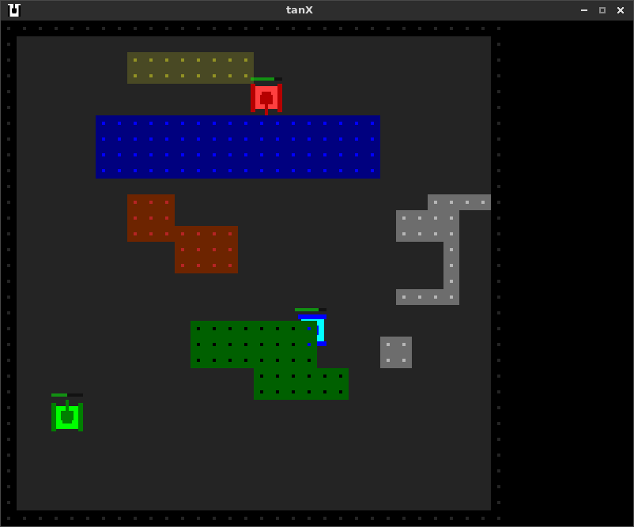

# tanX
A 2D tank game written in c++14 using SDL

## Library
+ SDL 1.2
+ SDL_ttf 2.0
+ SDL_mixer 1.2

## To Do
+ complete the server features
+ add game props such as weapons ans vehicles
+ display game status in the sidebar
+ add more kinds of terrain grids
+ add some sound effects (wait for someone to do)

## Futue Plan
1. AI interface

## How to Play
build this project to get server and client

start the server (only one player needs to do this)

`./lnx number_of_players`

start the client

`./tanX server_ip`

use arrow keys to move, spacebar to shoot

##Screenshoot

